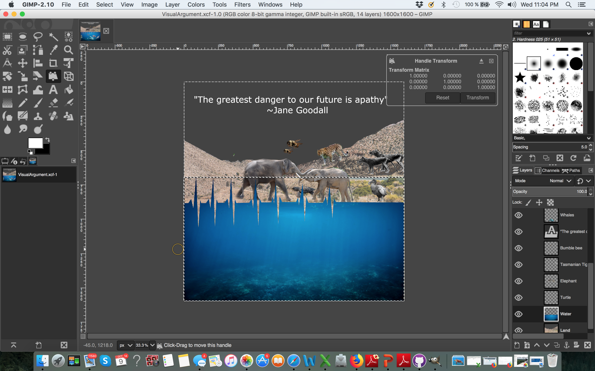
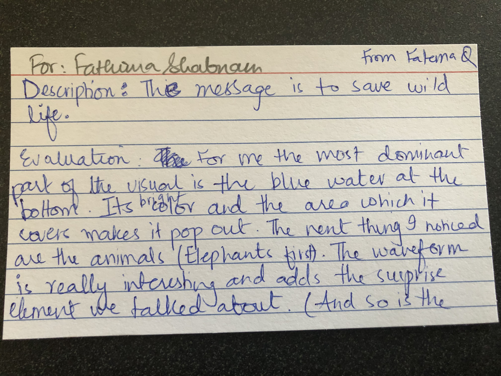

With this project, I struggled at the beginning to narrow my list of ideas and decide on one drawing to convey the argument I chose. In fact, even after deciding the best sketch among many, my vision changed a lot of the course of this project. While worried that I may second-guess my changes at the end, I was open to trying new ideas and removing parts that I was initially had my heart set on (my baby sea turtle got removed since I couldn't properly place it without it seeming out-of-place).
At first, I drew a sketch with a heartbeat rate in the middle of the page, and animals along it, like a timeline. I pictured it to have a solid background and almost have a cartoonish feel to it. However, after researching the animals that are endangered and reading articles on the extinction crisis, I realized I wanted this image to have a more serious cadence to it. It wasn’t until I started adding the animals to GIMP that I realized I could divide the image into land and water, and that would convey that this crisis affects all animals (I think it is more believable to accept that land animals are in danger, because we can see the affects much more easily- deforestation, for example, is very visible when we see before and after images). 

I started adding images to the canvas, adjusting their sizes, and removing their backgrounds with various tools (fuzzy select, free select, and eraser) [Figure 1]. Using the free select tool, I also decided to cut along the edge of the underwater layer in the shape of the heartbeat pattern. I had initially planned to add a downloaded image with the heartbeat rate, but none of the images available seemed suitable. After lots of deliberation, I realized I did not want the audience to catch the heartbeat rate first. I wanted the pattern to create movement and the disruption of pattern (the first three heartbeats are the same size and spacing but the ones following those are further apart and shorter, until it flatline) adds meaning to the context. However, I did not want that to be where the gaze first falls. Thus, I placed the two elephants in the middle of the image (size creating dominance), and then strategically increased the saturation of the water (color). I wanted viewer’s attention to be drawn to the water. This was done since I realized that the land, to an extent, camouflaged the animals (especially since the baby sea turtle, elephants and sand share similar color palattes) and I did not want the viewer to get lost/disinterested/confused if they were not directed to what they should be seeing next [Figure 2]. 

One aspect of this project that I challenged myself with is to have a strong message (especially because it’s one that is very common). My inspiration for this stemmed from the Save Water, Save Life image we discussed in class. The main message was to save water (one that is widely discussed), but there are so many elements to it (shown with skin color, clothing, and accessories such as pool toys). I wanted my argument to be more than just a “save wildlife” poster you may see and forget, but to have a lasting impact (as the save water argument did). I tried to achieve this using details such as the heartrate flatlining, the color desaturation of animals according to their statuses, and the placement of the human on the very left corner of the image.   

I desaturated the images of the extinct animals and gradient-desaturated the images of the critically endangered using layer masks and the gradient tool [Figure 3]. The vulnerable and endangered species went toward the left/middle, critically endangered around where the flatlining began, and extinct on the right. This placement with the heartbeat is crucial. The heartbeat rate here poses juxtaposition, and is meant to require thought on the viewer’s part. Directing a viewer from left to right is typical of a timeline and is meant to move from the past to present. However, here I place them in order of present to past (with the extinct animals on the right). With this in mind, it almost seems as if we are approaching a scenario toward extinction (and in combination with the text and statuses of the animals featured in the image), that’s what my argument claims. 

The text choice proved to be a real struggle. I tried multiple quotes and messages and none seemed to fit my message. It wasn’t until last class that the words, “time is running out for our friends” came to me and I thought it was perfect with the heartrate juxtaposition I mentioned earlier. Based on peer feedback, the previous grey sky caused unintended confusion [one example in Figure 4]. I shied away from adding a blue sky since I did not want to detract from the bright underwater blue, but did not want a cloudy sky since I worried it would be difficult for me to settle on a font color. However, after adding the cloudy sky (which also adds to the depressing feel of the situation), I tried adding a color gradient to the text and an outline and I really liked its dramatic effect with use of value (selection tool, gradient tool, duplicating the layer, enlarging the bottom layer and adding a fill to it). I chose Trajan font for a couple of reasons- it had feet, was bold, and is typically associated with historic times (and had a classical feel).

I realized that viewers would not have the knowledge of the statuses of animals in the image (I wouldn’t have if I had not read up on it), and per Dr. Miller’s suggestion, I set out to add a side bar. By doing this, I also addressed the comment I received during the peer review [Figure 4] by making this more clear. With this, I knew I wanted to add the threats these animals faced (and the message I hope viewers take away is that all of them are because of our habits), but I feared it would become crowded and text heavy. For this, I searched for the perfect font that will allow me the luxury of adding all the text I wanted. I first chose Stone Sans Serif (as it is very similar to NatGeo SemiBold- font used by national geographic), but I wasn’t pleased with that. Upon searching for similar sans serif fonts, I found Gotham family and thought it to be perfect. Using a combination of Gotham, Gotham SemiBold and Gotham Light fit my purposes well. To tie in the image with the sidebar, I used the heading font to be Trajan [Figure 5]. 

One element of surprise I added towards the end was the status of the human. With my placement of the human on the very left, I did not want attention to be drawn there at the beginning. I had hoped the viewer would start reading the side bar, come to the very end and then place the human (to my complete joy, that’s what my friend said she did when I showed my image to her this morning). We don't typically think of human beings as being threatened (not as we do animals at least), but I think this element of surprise (with the threats listed to be similar with the other animals) will prompt the viewer to question his/her biases. 

A few additional points I would like to point out are my use of negative space/density, proximity, and the number of animals in each species. I consciously chose to space my animals away from the left side of the image. Furthermore, I decided to make the extinct and critically endangered animals to be single animals- showing the decline in numbers and the increased difficulty in increasing the population. This contrast is meant to glimpse into what our future would look like without the diversity we have, and how currently so many animals are under threat. (Additional tidbit- all the animals face the human—I will leave that for your own interpretation) The only specie exempt from the rule of pairs/singles was the elephant, and that’s because we think of elephants to be gentle and intelligent creatures. I wanted to leave the care shown from mother to child to evoke emotion. 

Having never used GIMP before, I learned a lot from this project. I really enjoyed exploring this tool, and will probably make more visual arguments now that I have a way to do so. Final image [Figure 6]

Figure 1  

Figure 2  

Figure 3  

Figure 4  

Figure 5  

Figure 6  

