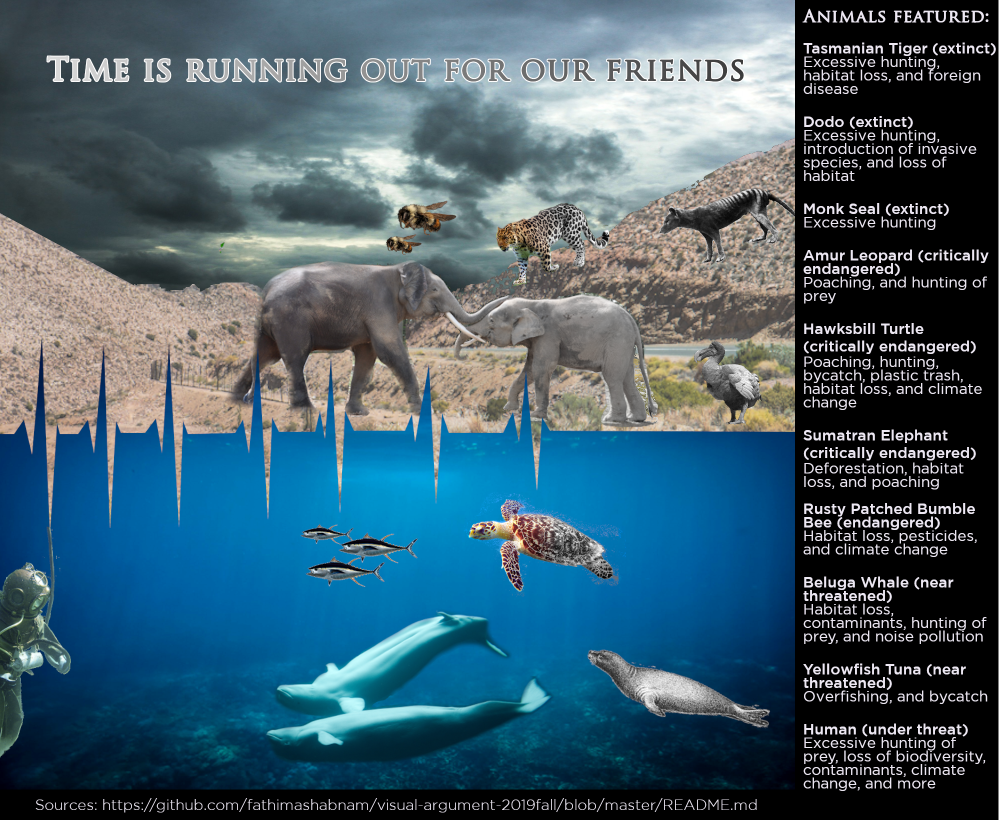

<h1> Visual Argument Progress Screenshots </h1> 

In this file, the main changes between images/highlights will be listed. Analyses on the changes and reason why they are highlights will be expanded in the reflection file.

Focus: Learning to edit images, remove backgrounds

Focus: Learning layers, choosing text for image, 

Focus: Finally learning how to add a layer mask and make the color desaturation with a gradient, adding gradient color change to text, adding sky 

Focus: Animals facing scuba diver (conscious choice), fonts being chosen, font color changing

Focus: Split the Tasmanian Tiger Couple, edited the borders, removed turtle 

